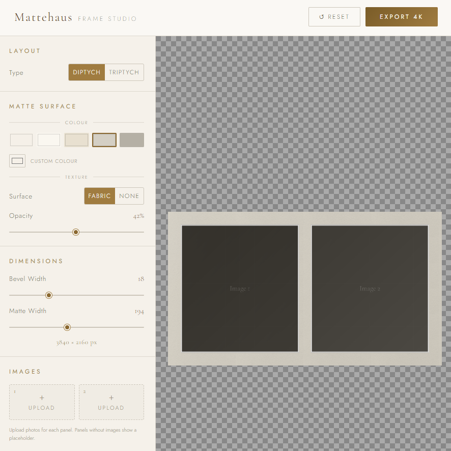

## Mattehaus Frame Studio

A lightweight, browser-based editor for arranging images into a polished matte frame layout. Everything runs locally in one HTML file.

> [!note]
>
> This is the companion app to Frame ▪ Art Manager, which uploads pictures to a Samsung Frame TV.  
> Frame ▪ Art Manager repo: <https://github.com/boysbytes/frame-art-manager>

## Getting started

1. Open `mattehaus-frame-studio.html` in a modern browser.
2. Add your images and adjust the layout controls.
3. Export the finished composition when you are done.
4. Use Frame ▪ Art Manager to upload the exported image to your Samsung Frame TV.

## Notes

- The app is self-contained.
- No build step or server is required.
- You can edit the single HTML file directly if you want to change the layout or styling.

## File overview

| File | Purpose |
| --- | --- |
| `mattehaus-frame-studio.html` | Single-file matte frame web app. |
